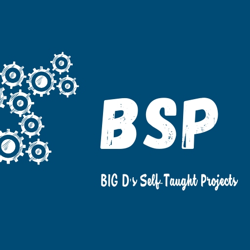

# Pomodoro64
Oğuz DEMİR : Please do not hesitate to ask anything. https://www.linkedin.com/in/oguz-demir-engineer/

This is a small CLI application for your pomodoros.

If you want to try pomodoro technique you can use it and develop program itself with using Pomodoro64 :)

Problem:
-
How can I practice pomodoro technique and record my duties to look at them later on ?
-
Sentence 1 :"I want to practice on pomodoro technique" 

Sentence 2 :"I want to practice on Python"

Solution:
-
Try to develop a python program for learning python while practice on pomodoro technique
-

Modules:
-
import winsound

import sys

import os

import time

import random

import datetime

import json

KEEP LEARNING !! :)
-

BigD's Self-Taught Project
-

